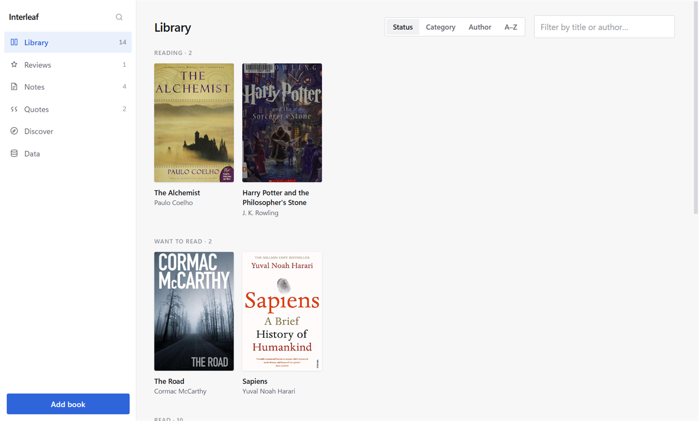
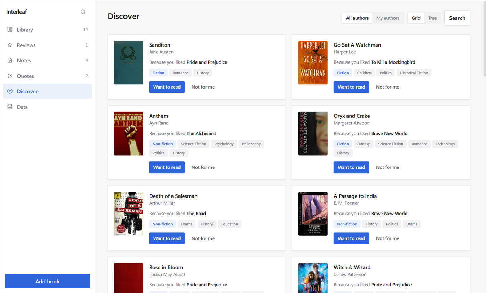
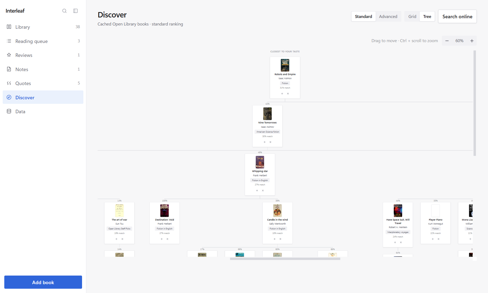
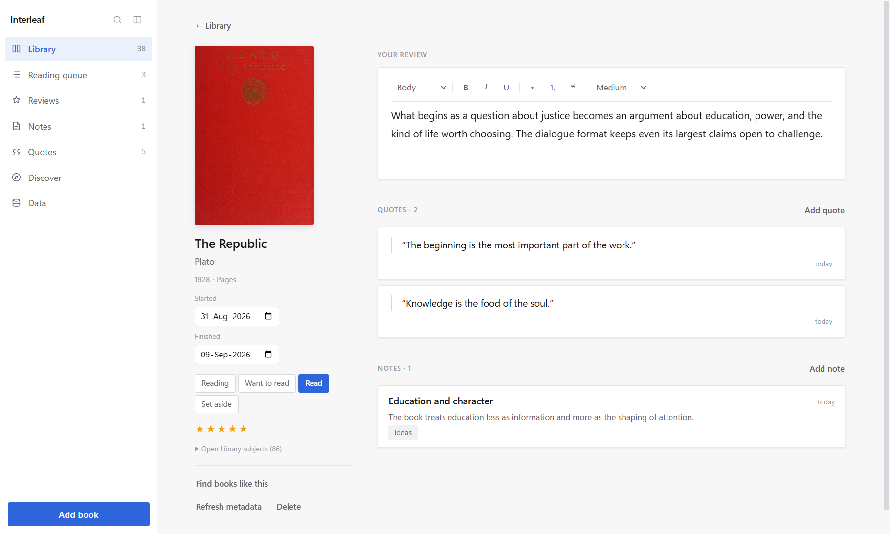
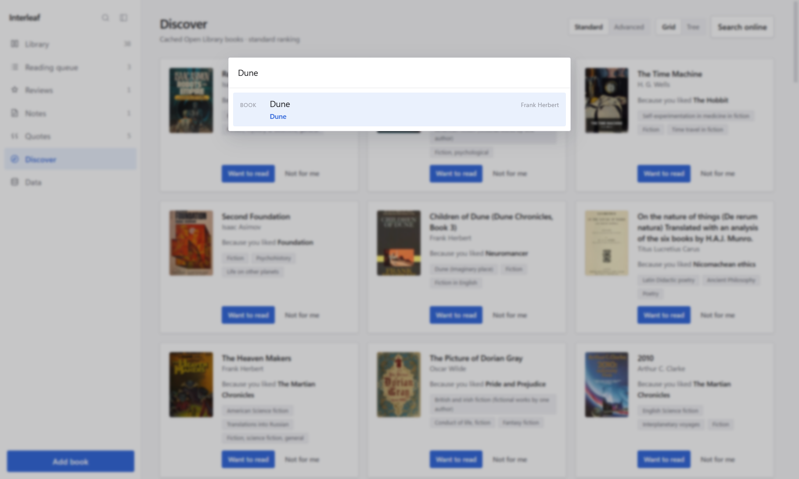

# Interleaf

[](https://github.com/sometabs/interleaf/actions/workflows/ci.yml)

A desktop reading journal. Keep a shelf of the books you've read, rate them, write what you thought,
collect the passages worth keeping, and get recommendations for what to read next.

Everything lives on your machine. The only thing that needs the internet is looking up a book's
cover and details.



**Discover** ranks unread books against your shelf and says which of your books each one resembles.



The same ranking as a tree, where depth is distance from your taste.



A book page: the review at the top, quotes and notes below, all edited in place.



`Ctrl + K` searches every book, review, note and quote at once.



## Install

There are no prebuilt downloads, you build it yourself. You'll need
[Node 22.12 or newer](https://nodejs.org) and Git.

```bash
git clone https://github.com/sometabs/interleaf.git
```

```bash
npm install
```

Then build the installer:

```bash
npm run build:win
```

It lands in `dist/`; run it to install the app normally.

**Platforms.** Windows is the one I build and use daily. `npm run build:linux` produces an AppImage
and a `.deb`, and the AppImage has been run on Debian. If something breaks on Linux, an issue would
be genuinely useful.

To skip the installer and just run the app from source:

```bash
npm run dev
```

An installer you built yourself runs without any security warning. If you send it to someone else,
though, it'll get flagged (it's not signed), as Windows flags anything downloaded from an
unknown publisher. They can click **More info → Run anyway**.

## What it does

**Your shelf.** Add a book by searching Open Library by title, author, or ISBN, and it arrives with
its cover, description and genres already filled in. Nothing found, or offline? Add it by hand and
fill in the details later. Each book is marked _want to read_, _reading_, _read_, or _set aside_ and rated out
of five.

**Reviews.** One per book, at the top of its page. Start typing; it saves itself.

**Notes.** What you thought. Attach them to a book, or write one that belongs to nowhere in
particular. Each can carry a label, and long ones open as a full page.

**Quotes.** What the book said. They get their own section on each book and their own screen, and
they show the passage rather than a title you'd have to invent. Every quote belongs to a book; a
thought that belongs to no single book is a note.

**Search.** One box finds any word in any book, review, note or quote, instantly.

**Discover.** Recommendations built from your own shelf: it reads what you rated 4 or 5, looks up
similar books, and ranks them against your taste. Every suggestion tells you which of your books it
resembles. Nothing is uploaded, and no profile is built about you anywhere.

**Books like this one.** Any book on your shelf has a "Find books like this" button, which asks the
same question of that book alone instead of your whole taste. It searches what Discover has already
found, so it is instant, and it comes up empty when the book sits far from everything else you read.

**Highlights from Calibre.** Export your highlights from the Calibre viewer and read the file
straight into Interleaf, notes and dates included. Calibre's export names no books, only numbers, so
you match each one to a book yourself the first time and it is remembered after that. Re-importing
the same file adds nothing twice. Nothing touches your Calibre library.

**Backups.** One button writes your whole library to a folder you choose: the database, the covers,
and a Markdown copy of everything you have written. Another button reads it back, replacing what you
have. Nothing is lost in either direction.

**Your data, in plain text.** The Markdown in that folder is yours to read in any editor or keep in
Git: each book with its status and rating, its review, its notes and its quotes, each dated. It is
written for reading rather than for restoring, which the database beside it does.

## Getting around

| key        | action                                                |
| ---------- | ----------------------------------------------------- |
| `Ctrl + K` | Command palette, jump to anything, or run any command |
| `Ctrl + N` | Add a book                                            |
| `Esc`      | Back one step                                         |

The command palette is the fastest route to everything. (Might add support for more shortcuts).

Editors save roughly a second after you stop typing. There is no save button and nothing to press.

## Where your data lives

- **Windows**: `%APPDATA%\Interleaf\`
- **Linux**: `~/.config/Interleaf/`

Runs from source and preview builds use a separate `Interleaf Dev` directory under the same
platform-specific application-data folder, so development cannot modify the installed library.

That folder holds `interleaf.db` (everything you've written) and a `covers/` cache. Back up the
`.db` file and you've backed up the app. Deleting `covers/` is safe because they re-download.

## Notes and limits

Book data comes from [Open Library](https://openlibrary.org). When it's slow or down, search will
say so. Add the book by hand and use **Refresh metadata** on its page once it's back.

Building a recommendation list takes about a minute the first time. That's deliberate: Open Library
asks for one request per second, and Interleaf respects it.

## Development

847 tests across 57 files, run in two environments. The database, the Open Library client and the
recommender are tested in plain Node. The React components are mounted in jsdom, a simulated
browser, so those tests click real buttons and type into real editors.

| command             | what it checks                   |
| ------------------- | -------------------------------- |
| `npm test`          | the suite above                  |
| `npm run lint`      | ESLint and Prettier              |
| `npm run typecheck` | `tsc` over main, preload and web |

## License

[MIT](LICENSE).
